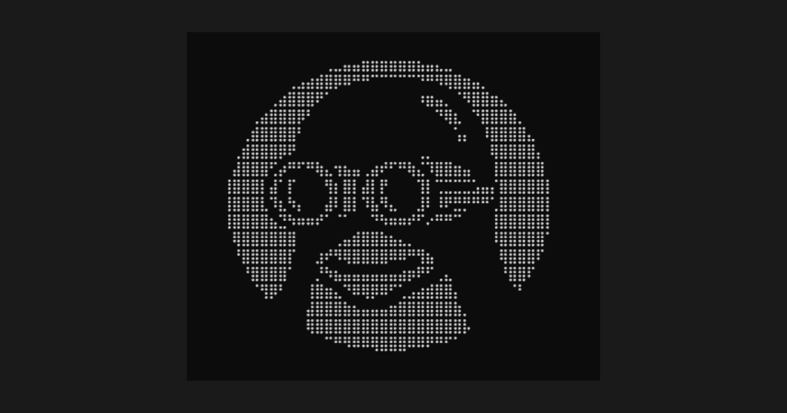

<div align="center">

<br/>



<br/>

# uConsole Cloud

**Remote monitoring and management for the [ClockworkPi uConsole](https://www.clockworkpi.com/uconsole).**

[](https://uconsole.cloud)

[](https://nextjs.org)
[](https://typescriptlang.org)
[](https://tailwindcss.com)
[](https://vercel.com)
[](CHANGELOG.md)
[]()
[](LICENSE)

</div>

---

## What is this?

A three-tier platform for managing the ClockworkPi uConsole — a modular ARM handheld Linux terminal (RPi CM4, 5" IPS, QWERTY keyboard, Debian Bookworm).

**On your device:** a `.deb` package installs 45+ management scripts, a curses TUI with 8 categories (including FM radio, GPS globe, Marauder serial, battery discharge testing, forum browser, games), a Flask web dashboard with terminal access, and systemd services that push telemetry to the cloud every 5 minutes.

**On your local network:** the web dashboard runs at `https://uconsole.local` via nginx + self-signed TLS + mDNS, accessible from any phone or laptop on the same WiFi. If no known network is available, the device creates a fallback AP ("uConsole") so you can always connect.

**In the cloud:** this Next.js app at [uconsole.cloud](https://uconsole.cloud) shows live device status, backup coverage, system inventory, and hardware info — from anywhere.

```
┌──────────────────────────────────────────────────────────────┐
│                      uconsole.cloud                          │
├──────────────────────────────────────────────────────────────┤
│                                                              │
│  ┌──────────────┐  ┌──────────────┐  ┌────────────────────┐ │
│  │ Battery: 100% │  │ CPU: 34.0°C  │  │ WiFi: MyNetwork    │ │
│  │ Charging      │  │ Load: 0.18   │  │ Signal: -57 dBm    │ │
│  └──────────────┘  └──────────────┘  └────────────────────┘ │
│                                                              │
│  ┌──────────────┐  ┌──────────────┐  ┌────────────────────┐ │
│  │ Mem: 1.5/3.8G │  │ Disk: 45%    │  │ SDR: RTL2838       │ │
│  │               │  │ 13G / 29G    │  │ LoRa: SX1262       │ │
│  └──────────────┘  └──────────────┘  └────────────────────┘ │
│                                                              │
│  ● Device offline — last seen 2h ago                         │
│                                                              │
│  ┌──── Backup Coverage ─────────────────────────────────┐    │
│  │  Shell configs   ● today   │  Desktop       ● 6d     │    │
│  │  System configs  ● today   │  Git/SSH       ● today  │    │
│  │  Packages (287)  ● today   │  GitHub CLI    ● today  │    │
│  │  Browser (12)    ● today   │  Scripts       ● today  │    │
│  └──────────────────────────────────────────────────────┘    │
│                                                              │
│  Backup History │ Packages │ Extensions │ Scripts │ Repo     │
└──────────────────────────────────────────────────────────────┘
```

### Features

- **Live device telemetry** — battery, CPU, memory, disk, WiFi, screen, AIO board — pushed every 5 minutes
- **Persistent status** — last-known data survives reboots and offline periods, with staleness indicators
- **Hardware manifest** — detects expansion module, SDR, LoRa, GPS, RTC, ESP32 at setup
- **Backup monitoring** — coverage across 9 categories, commit history with sparklines and calendar grid
- **System inventory** — packages, browser extensions, scripts manifest, repo tree
- **Local web dashboard** — HTTPS at `uconsole.local` via mDNS, with WiFi fallback AP
- **Same-network detection** — shows a direct link to the local dashboard when you're on the same WiFi
- **Curses TUI** — 8 categories, 14+ tools (FM radio, GPS globe, Marauder serial, discharge testing, forum browser, games)
- **PWA** — installable on iOS/Android for quick access from your phone
- **Device code auth** — link devices with an 8-character code or QR scan, no typing passwords on tiny keyboards
- **APT repository** — `curl | sudo bash` adds the repo, `apt upgrade` handles future updates
- **Diagnostics** — `uconsole doctor` checks services, SSL, nginx, connectivity, timer health
- **Automated releases** — GitHub Actions builds `.deb`, publishes to APT repo, tags release

### Optional hardware

The [HackerGadgets AIO expansion board](https://www.hackergadgets.com/) adds RTL-SDR, LoRa SX1262, GPS, and RTC to the uConsole. All radio features in the dashboard gracefully degrade when no AIO board is present — most users won't have one, and everything works without it.

---

## Screenshots

<div align="center">

<table>
<tr>
<td align="center" width="50%">

**Landing Page**


*Sign in, install, link your device*

</td>
<td align="center" width="50%">

**Repo Linking**


*Auto-detects your uconsole backup repo*

</td>
</tr>
<tr>
<td align="center">

**Dashboard Overview**


*Restore readiness, backup coverage across 8 categories, repo stats*

</td>
<td align="center">

**Device Status**


*Battery donut, CPU temp, memory, disk, WiFi, uptime, kernel*

</td>
</tr>
</table>

</div>

---

## Install

```bash
curl -s https://uconsole.cloud/install | sudo bash
```

That's it. This adds the APT repo and runs `apt install uconsole-cloud`. Then:

```bash
uconsole setup
```

The setup wizard detects your hardware, generates SSL certs, sets passwords, and optionally links to uconsole.cloud. After that, `sudo apt upgrade` handles future updates.

Cloud is optional — everything works offline.

---

## Architecture

```
uConsole (arm64, Debian)                 Cloud (Vercel)
┌──────────────────────────┐         ┌──────────────────────────┐
│                          │         │                          │
│  /opt/uconsole/          │         │  uconsole.cloud          │
│  ├── bin/                │         │                          │
│  │   ├── uconsole  CLI   │         │  Upstash Redis           │
│  │   └── console   TUI   │         │  (device:{repo}:status)  │
│  ├── scripts/            │         │         │                │
│  │   ├── system/         │         │         │                │
│  │   │   └── push-status ────→     │         ▼                │
│  │   ├── power/          │  POST   │  Next.js 16 SSR          │
│  │   ├── network/        │         │  ┌────────────────────┐  │
│  │   ├── radio/          │         │  │ Server Components  │  │
│  │   └── util/           │         │  │ + GitHub API proxy │  │
│  ├── webdash/            │         │  └────────────────────┘  │
│  │   └── app.py    ◄──┐│         │         │                │
│  └── lib/               ││         │         ▼                │
│                    nginx ││         │    HTML stream           │
│                    :443  ││         │                          │
│                          ││         │  /apt/ (APT repository)  │
└──────────────────────────┘│         │  /install (bootstrap)    │
                            │         └──────────────────────────┘
  Phone / Browser           │
  ┌─────────────────┐       │
  │ uconsole.cloud   │ ◄─────── Vercel CDN
  │ uconsole.local   │ ◄──┘
  └─────────────────┘
```

**Device → Redis → Dashboard.** No polling from the browser. The device pushes; the dashboard reads on page load. Data persists indefinitely — the last-known status is always available.

---

## Device telemetry

`push-status.sh` collects from sysfs and procfs every 5 minutes:

| Category | Source | Metrics |
|----------|--------|---------|
| Battery | `/sys/class/power_supply/axp20x-battery/` | capacity, voltage, current, status, health |
| CPU | `/sys/class/thermal/`, `/proc/loadavg` | temperature, load average, core count |
| Memory | `/proc/meminfo` | total, used, available |
| Disk | `df` | total, used, available, percent |
| WiFi | `iwconfig wlan0` | SSID, signal dBm, quality, bitrate, IP |
| Screen | `/sys/class/backlight/` | brightness, max brightness |
| AIO Board | `lsusb`, `/dev/spidev4.0`, `/dev/ttyS0`, `i2cdetect` | SDR, LoRa, GPS fix, RTC sync |
| Hardware | `/etc/uconsole/hardware.json` | expansion module, component detection, system info |
| Webdash | `systemctl` | running, port |
| System | `hostname`, `uname`, `/proc/uptime` | hostname, kernel, uptime |

---

## uconsole CLI

```
uconsole setup       Interactive setup wizard (hardware detect, passwords, SSL, cloud link)
uconsole link        Link device to uconsole.cloud (code auth + QR, no wizard)
uconsole push        Push status to cloud now
uconsole status      Show config, timer status, last push time
uconsole doctor      Diagnose services, SSL, nginx, connectivity, cron/timer conflicts
uconsole restore     Run restore.sh from backup repo (detects ~/uconsole)
uconsole unlink      Remove cloud config and stop timer
uconsole update      Update via APT (or re-download scripts for curl installs)
uconsole version     Show installed version
uconsole help        Show all commands
```

---

## .deb package

```
apt install uconsole-cloud
```

Installs to `/opt/uconsole/` with organized subdirectories:

```
uconsole-cloud_0.1.1_arm64.deb
├── /opt/uconsole/
│   ├── bin/                    uconsole CLI, console TUI launcher
│   ├── lib/                    tui_lib.py, lib.sh, shared modules
│   ├── scripts/
│   │   ├── system/             push-status, backup, restore, update, doctor, setup
│   │   ├── power/              battery, charge, discharge-test (safety-critical)
│   │   ├── network/            wifi, hotspot, tailscale
│   │   ├── radio/              sdr, lora, gps, rtc, marauder (AIO board)
│   │   └── util/               everything else (forum browser, games, etc.)
│   ├── webdash/                Flask app, templates, static assets
│   └── share/                  themes, battery-data, esp32, default configs
├── /etc/uconsole/              uconsole.conf, hardware.json, ssl/
├── /etc/systemd/system/        7 unit files (not auto-enabled)
├── /etc/nginx/sites-available/ uconsole-webdash (not auto-enabled)
├── /etc/avahi/services/        mDNS advertisement
└── /usr/bin/uconsole           symlink → /opt/uconsole/bin/uconsole
```

**Dependencies:** python3, python3-flask, python3-bcrypt, python3-socketio, curl, nginx, systemd, qrencode  
**Recommends:** avahi-daemon, network-manager  
**Suggests:** gpsd, rtl-sdr, gh

Services are **not** auto-started on install — `uconsole setup` handles that after the interactive configuration wizard.

### Building

```bash
make build-deb          # → dist/uconsole-cloud_0.1.1_arm64.deb
make publish-apt        # update APT repo in frontend/public/apt/
make release            # bump version, build, publish, commit + tag
```

### Release automation

Releases are built via GitHub Actions. The workflow builds the `.deb`, updates the GPG-signed APT repository in `frontend/public/apt/`, and creates a GitHub release with the `.deb` attached. On merge to `main`, Vercel auto-deploys the updated APT repo to `uconsole.cloud/apt/`.

---

## API routes

| Route | Method | Auth | Purpose |
|-------|--------|------|---------|
| `/api/device/code` | POST | No | Generate device code (rate-limited 5/min/IP) |
| `/api/device/code/confirm` | POST | Session | Confirm code, generate device token |
| `/api/device/poll/[secret]` | GET | No | Poll for code confirmation |
| `/api/device/push` | POST | Bearer | Accept device telemetry |
| `/api/device/status` | GET | Session | Fetch cached status + online flag |
| `/api/github/*` | GET/POST | Session | GitHub API proxy (repos, commits, tree) |
| `/api/settings` | GET/POST/DELETE | Session | User settings, repo linking |
| `/api/settings/regenerate-token` | POST | Session | Regenerate device token |
| `/api/scripts/[name]` | GET | No | Serve allowlisted scripts (uconsole, push-status.sh) |
| `/api/raw` | GET | Session | Fetch raw file content from backup repo |
| `/api/health` | GET | No | Redis health check |
| `/install` | GET | No | APT bootstrap script (adds repo + installs package) |
| `/apt/*` | GET | No | GPG-signed APT repository (Packages, Release, .deb files) |
| `/link` | Page | No | Device code entry (accepts `?code=` for QR scan) |
| `/docs` | Page | No | Documentation (install, CLI, architecture, troubleshooting) |

See [docs/DEVICE-LINKING.md](docs/DEVICE-LINKING.md) for the full device auth flow.

---

## Project structure

```
uconsole-cloud/
├── frontend/                       Next.js 16 app (88 TS/TSX files)
│   ├── src/
│   │   ├── app/                    Pages, API routes, server actions
│   │   │   ├── page.tsx            Main dashboard (Server Component)
│   │   │   ├── link/page.tsx       Device code entry page
│   │   │   ├── docs/page.tsx       Documentation page
│   │   │   ├── install/route.ts    APT bootstrap script endpoint
│   │   │   ├── actions.ts          Server actions (sign in/out, unlink)
│   │   │   ├── manifest.ts         PWA manifest
│   │   │   └── api/                16 API routes
│   │   ├── components/
│   │   │   ├── dashboard/          17 dashboard sections
│   │   │   ├── viz/                7 visualization components (sparkline, donut, treemap, etc.)
│   │   │   └── *.tsx               Shared UI (RepoLinker, DeviceCodeForm, CopyCommand, etc.)
│   │   ├── lib/                    20 modules (auth, redis, github, device config, etc.)
│   │   └── __tests__/              10 test suites, 211 tests (vitest)
│   ├── public/
│   │   ├── scripts/                Install-time copies of CLI + push-status.sh
│   │   ├── install.sh              APT bootstrap installer
│   │   └── apt/                    GPG-signed APT repository (Packages, Release, .deb)
│   └── next.config.ts              Security headers, APT MIME types, image config
├── example-device/                 Scrubbed device tree for contributors
│   ├── bin/                        uconsole CLI, console TUI launcher
│   ├── lib/                        tui_lib.py, lib.sh, shared modules
│   ├── scripts/                    45+ scripts (system, power, network, radio, util)
│   ├── webdash/                    Flask app (app.py, templates, static)
│   └── share/                      themes, battery-data, esp32, default configs
├── packaging/                      .deb build system
│   ├── build-deb.sh                Build script (reads VERSION, organized layout)
│   ├── control                     Package metadata + dependencies
│   ├── postinst, prerm, postrm     Lifecycle hooks (config setup, teardown, purge)
│   ├── defaults/                   uconsole.conf.default
│   ├── systemd/                    7 unit files (status, backup, update timers + webdash)
│   ├── nginx/                      HTTPS reverse proxy config
│   ├── avahi/                      mDNS service advertisement
│   └── scripts/                    generate-repo.sh, generate-gpg-key.sh
├── docs/                           Architecture documentation
│   └── DEVICE-LINKING.md           Device auth flow (ASCII diagrams, API shapes, edge cases)
├── studio/                         Sanity CMS workspace (landing page content)
├── .github/
│   ├── workflows/                  Release automation (build .deb, publish APT)
│   └── ISSUE_TEMPLATE/             Bug report + feature request templates
├── Makefile                        build-deb, publish-apt, release, version bumps
├── VERSION                         Package version (0.1.1)
└── package.json                    npm workspace root (frontend + studio)
```

---

## Security

| Protection | Implementation |
|------------|----------------|
| Auth | NextAuth v5 + GitHub OAuth, middleware-enforced on all API routes |
| Device auth | Bearer tokens (90-day UUIDs), rate-limited code generation (5/min/IP) |
| Input validation | Path traversal blocks, SHA regex, strict repo format validation |
| Headers | CSP, X-Frame-Options DENY, nosniff, Referrer-Policy, Permissions-Policy |
| Error handling | Typed GitHubError (401/403 surfaced), error boundary hides internals |
| Data isolation | Redis keys scoped by repo, device tokens scoped by user |
| Local TLS | Self-signed cert at `/etc/uconsole/ssl/` (generated at install) |
| Secrets | `status.env` is chmod 600, owned by device user |
| APT repo | GPG-signed Release files, key distributed via HTTPS |

---

## Tech stack

| Layer | Technology | Purpose |
|-------|------------|---------|
| Framework | Next.js 16 | App Router, Server Components, Server Actions |
| Auth | NextAuth v5 | GitHub OAuth with JWT strategy |
| Data | Upstash Redis | Device telemetry (persistent), device codes (10-min TTL) |
| Backup data | GitHub REST API | Commits, tree, raw files, packages |
| CMS | Sanity v3 | Landing page and dashboard copy |
| Styling | Tailwind CSS v4 | GitHub-dark theme with CSS variables |
| Testing | Vitest 4 | 211 tests — parsing, security, API, validation |
| Hosting | Vercel | Auto-deploy from main, preview on PRs |
| CI/CD | GitHub Actions | Automated `.deb` builds, APT repo publishing |
| Device | Bash + Python | 45+ scripts, Flask webdash, curses TUI, systemd services |
| Packaging | dpkg + APT | `.deb` for arm64, GPG-signed repository on Vercel CDN |

---

## Local development

```bash
git clone https://github.com/mikevitelli/uconsole-cloud.git
cd uconsole-cloud
npm install

# Configure environment
cp frontend/.env.example frontend/.env.local
# Fill in: GITHUB_ID, GITHUB_SECRET, AUTH_SECRET,
#          UPSTASH_REDIS_REST_URL, UPSTASH_REDIS_REST_TOKEN

npm run dev        # frontend :3000, studio :3333
npm test           # 211 tests (vitest)
npm run build      # production build
npm run lint       # ESLint
```

### Makefile targets

```
make version       Print current version
make bump-patch    Bump patch version (0.1.1 → 0.1.2)
make bump-minor    Bump minor version (0.1.1 → 0.2.0)
make bump-major    Bump major version (0.1.1 → 1.0.0)
make build-deb     Build .deb package to dist/
make publish-apt   Update APT repo from latest .deb
make release       Bump + build + publish + commit + tag
make clean         Remove build artifacts
```

---

## Environments

| Environment | Domain | Trigger |
|-------------|--------|---------|
| Production | [`uconsole.cloud`](https://uconsole.cloud) | Push to `main` |
| Preview | `*.vercel.app` | PRs and branches |
| Local | `localhost:3000` | `npm run dev` |

---

## Contributing

See [CONTRIBUTING.md](CONTRIBUTING.md). Issues and PRs welcome — especially from uConsole owners who can test device-side changes on real hardware.

---

<div align="center">

Built for the [ClockworkPi uConsole](https://www.clockworkpi.com/uconsole).

`88 source files · 211 tests · 16 API routes · 32 components · 45+ device scripts`

</div>
