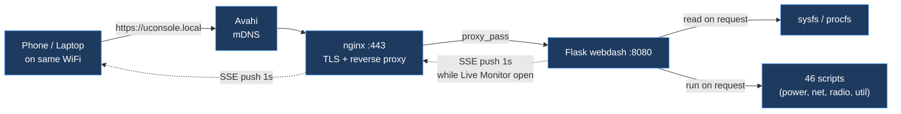

<div align="center">

<br/>


<br/>

**Remote monitoring and management for the [ClockworkPi uConsole](https://www.clockworkpi.com/uconsole).**

[](https://uconsole.cloud)

[](https://github.com/mikevitelli/uconsole-cloud/releases)
[](https://github.com/mikevitelli/uconsole-cloud/actions)
[](LICENSE)
[](https://nextjs.org)
[](https://typescriptlang.org)
[](https://tailwindcss.com)
[](https://vercel.com)

</div>

---

## What is this?

A three-tier platform for managing the [ClockworkPi uConsole](https://www.clockworkpi.com/uconsole) — an RPi CM4 handheld Linux terminal running Debian Bookworm.

- **Device** — a `.deb` installs a curses TUI (9 categories, 53 native tools — FM radio, global ADS-B map, Marauder, Telegram, Watch Dogs Go, ROM launcher, and more), a Flask web dashboard, 46 management scripts, and systemd services.
- **Local network** — the webdash serves at `https://uconsole.local` via nginx + self-signed TLS + mDNS. No known WiFi? The device spins up a fallback AP (`uConsole`) so your phone or laptop can always reach it.
- **Cloud** — [uconsole.cloud](https://uconsole.cloud) is a Next.js app that shows live device telemetry, backup coverage, system inventory, and hardware info from anywhere. Fully optional — everything works offline.

Hardware-optional features (RTL-SDR, LoRa, GPS, RTC, ESP32) gracefully degrade when the [HackerGadgets AIO expansion](https://www.hackergadgets.com/) isn't installed.

---

## Screenshots

<div align="center">

<table>
<tr>
<td align="center" width="50%">

**Landing Page**


*Sign in, install, link your device*

</td>
<td align="center" width="50%">

**Repo Linking**


*Auto-detects your uconsole backup repo*

</td>
</tr>
<tr>
<td align="center">

**Dashboard Overview**


*Backup coverage across 9 categories, repo stats*

</td>
<td align="center">

**Device Status**


*Battery donut, CPU temp, memory, disk, WiFi, uptime, kernel*

</td>
</tr>
</table>

</div>

---

## Install

```bash
curl -s https://uconsole.cloud/install | sudo bash
uconsole setup
```

The bootstrap adds the GPG-signed APT repo and installs the `uconsole-cloud` package. `uconsole setup` walks through hardware detection, passwords, SSL certs, and optional cloud linking. `sudo apt upgrade` handles future updates.

---

## Polling and data flow

Three independent data paths. Only one actually *polls*; the other two are event-driven or on-demand.

### 1. Device → Cloud telemetry (systemd timer)

This is the only real polling loop. A user-scope systemd timer fires `push-status.sh` on an interval (default 5 min, configurable via the TUI from `30s` to `30min`, or **off** to opt out entirely).

```mermaid
flowchart LR
  Timer["<b>uconsole-status.timer</b><br/>OnUnitActiveSec (default 5min)"] --> Script["push-status.sh"]
  Script --> Collect["Collect from sysfs/procfs<br/>battery · cpu · mem · disk<br/>wifi · aio board · hardware"]
  Collect --> HTTP["POST /api/device/push<br/>Bearer <device_token>"]
  HTTP --> Redis[("Upstash Redis<br/>persistent, keyed by user+device")]
  Redis -. "read on page load" .-> Dashboard["Next.js Server Component"]

  TUI["<b>TUI</b><br/>CONFIG → Push Interval"] -.->|rewrites OnUnitActiveSec<br/>or disables timer| Timer

  classDef user fill:#1e3a5f,stroke:#58a6ff,color:#fff;
  classDef cloud fill:#2d1a3d,stroke:#d67aff,color:#fff;
  class TUI,Timer,Script,Collect user
  class HTTP,Redis,Dashboard cloud
```



Collected every tick: battery (capacity, voltage, current, health), CPU (temp, load, cores), memory, disk, WiFi (SSID, signal, IP), screen brightness, AIO board presence (SDR, LoRa, GPS, RTC), hardware manifest, webdash status, hostname/kernel/uptime.

**Opting out:** pick **Push Interval → off** in the TUI under `CONFIG`. The timer gets disabled via `systemctl --user disable --now uconsole-status.timer`. Reversible — picking any interval re-enables it.

### 2. Cloud dashboard reads (no polling)

The Next.js dashboard uses React Server Components. Redis is queried **once per page load**, on the server. No client-side setInterval, no WebSocket, no long-poll. Data refreshes when you navigate or reload.

```mermaid
flowchart LR
  Browser["Browser"] -->|GET /<br/>(on load / nav)| Edge["Vercel Edge"]
  Edge --> RSC["React Server Component<br/>app/page.tsx"]
  RSC --> Redis[("Upstash Redis")]
  Redis --> RSC
  RSC -->|streamed HTML| Edge
  Edge -->|streamed HTML| Browser

  classDef cloud fill:#2d1a3d,stroke:#d67aff,color:#fff;
  class Browser,Edge,RSC,Redis cloud
```

This means the dashboard is always "as fresh as the last push". If your device has pushed in the last 5 minutes you see live state; if it's offline you see the last-known snapshot with a staleness indicator.

### 3. Local webdash (on-demand + SSE)

The Flask webdash at `https://uconsole.local` reads sysfs and runs shell scripts **on request**. The Live Monitor panel uses Server-Sent Events for a 1-second push from Flask → browser while the panel is open; closing the panel ends the stream.



No scheduled background polling from the webdash itself — scripts only run when you click them.

---

## Device telemetry payload

`push-status.sh` collects from sysfs and procfs on each tick:

| Category | Source | Metrics |
|----------|--------|---------|
| Battery | `/sys/class/power_supply/axp20x-battery/` | capacity, voltage, current, status, health |
| CPU | `/sys/class/thermal/`, `/proc/loadavg` | temperature, load average, core count |
| Memory | `/proc/meminfo` | total, used, available |
| Disk | `df` | total, used, available, percent |
| WiFi | `iwconfig wlan0` | SSID, signal dBm, quality, bitrate, IP |
| Screen | `/sys/class/backlight/` | brightness, max brightness |
| AIO Board | `lsusb`, `/dev/spidev4.0`, `i2cdetect` | SDR, LoRa, GPS fix, RTC sync |
| Hardware | `/etc/uconsole/hardware.json` | expansion module, component detection |
| Webdash | `systemctl` | running, port |
| System | `hostname`, `uname`, `/proc/uptime` | hostname, kernel, uptime |

---

## uconsole CLI

```
uconsole setup       Interactive setup wizard (hardware detect, passwords, SSL, cloud link)
uconsole link        Link device to uconsole.cloud (code auth + QR, no wizard)
uconsole push        Push status to cloud now
uconsole status      Show config, timer status, last push time
uconsole doctor      Diagnose services, SSL, nginx, connectivity, cron/timer conflicts
uconsole restore     Run restore.sh from backup repo
uconsole unlink      Remove cloud config and stop timer
uconsole update      Update via APT
uconsole logs [svc]  Tail systemd logs for a service (defaults to webdash)
uconsole version     Show installed version
uconsole help        Show all commands
```

---

## .deb package

```
uconsole-cloud_x.y.z_arm64.deb
├── /opt/uconsole/
│   ├── bin/         uconsole CLI, console TUI launcher
│   ├── lib/         tui_lib.py, ascii_logos.py, tui/ submodules
│   ├── scripts/     46 scripts (system, power, network, radio, util)
│   ├── webdash/     Flask app (app.py, templates, static, docs)
│   └── share/       themes, battery-data, esp32 firmware, defaults
├── /etc/uconsole/           uconsole.conf, hardware.json, ssl/
├── /etc/systemd/system/     7 unit files (not auto-enabled)
├── /etc/nginx/sites-available/  uconsole-webdash
├── /etc/avahi/services/     mDNS advertisement
└── /usr/bin/uconsole, /usr/bin/console  symlinks into /opt/uconsole/bin/
```

**Dependencies:** `python3`, `python3-flask`, `python3-bcrypt`, `python3-socketio`, `curl`, `nginx`, `systemd`, `qrencode`
**Recommends:** `avahi-daemon`, `network-manager`
**Suggests:** `gpsd`, `rtl-sdr`, `gh`

Services install but **do not auto-start** — `uconsole setup` enables them after interactive configuration.

---

## TUI (`console`)

```
SYSTEM   MONITOR   FILES   POWER   NETWORK   RADIO   SERVICES   TOOLS   GAMES   CONFIG
```

53 native tools wired into 9 categories, plus direct-run shell scripts. Gamepad and keyboard input (curses). Highlights:

- **MONITOR** — 1-second live gauges for CPU, memory, disk, temperature, battery, network
- **RADIO** — FM radio, GPS globe, global ADS-B map with layered basemap and hi-res fetch, ESP32 Marauder hub
- **TOOLS** — git panel, notes, calculator, stopwatch, Telegram client (tg + tdlib), weather, Hacker News, uConsole forum
- **GAMES** — Watch Dogs Go (auto-installs on first launch), minesweeper, snake, tetris, 2048, ROM launcher
- **CONFIG** — theme picker, view mode, keybinds, battery gauge, trackball scroll, push interval, Watch Dogs config

External programs (emulators, Watch Dogs Go) launch through a shared `tui.launcher` helper that uses `start_new_session=True` + `DEVNULL` stdio, so a child exit or crash can't signal the curses parent.

---

## API routes (cloud)

| Route | Method | Auth | Purpose |
|-------|--------|------|---------|
| `/api/device/code` | POST | No | Generate device code (rate-limited 5/min/IP) |
| `/api/device/code/confirm` | POST | Session | Confirm code, issue device token |
| `/api/device/poll/[secret]` | GET | No | Poll for code confirmation |
| `/api/device/push` | POST | Bearer | Accept device telemetry |
| `/api/device/status` | GET | Session | Fetch cached status + online flag |
| `/api/github/*` | GET/POST | Session | GitHub API proxy |
| `/api/settings` | GET/POST/DELETE | Session | User settings, repo linking |
| `/api/scripts/[name]` | GET | No | Serve allowlisted scripts |
| `/api/health` | GET | No | Redis health check |
| `/install` | GET | No | APT bootstrap script |
| `/apt/*` | GET | No | GPG-signed APT repository |

See [docs/DEVICE-LINKING.md](docs/DEVICE-LINKING.md) for the full device auth flow.

---

## Security

| Protection | Implementation |
|------------|----------------|
| Auth | NextAuth v5 + GitHub OAuth, middleware-enforced on all API routes |
| Device auth | Bearer tokens (90-day UUIDs), rate-limited code generation (5/min/IP) |
| Input validation | Path traversal blocks, SHA regex, strict repo format validation |
| Headers | CSP, X-Frame-Options DENY, nosniff, Referrer-Policy, Permissions-Policy |
| Data isolation | Redis keys scoped by repo, device tokens scoped by user |
| Local TLS | Self-signed cert at `/etc/uconsole/ssl/` (generated at install) |
| Secrets | `status.env` is chmod 600, owned by device user |
| APT repo | GPG-signed `Release` files, key distributed via HTTPS |

---

## Tech stack

| Layer | Technology |
|-------|------------|
| Framework | Next.js 16 (App Router, Server Components, Server Actions) |
| Auth | NextAuth v5 (GitHub OAuth, JWT) |
| Data | Upstash Redis (device telemetry, device codes) |
| Backup data | GitHub REST API |
| CMS | Sanity v3 |
| Styling | Tailwind CSS v4 |
| Testing | Vitest 4 (frontend, 117 tests) + pytest (device, 997 tests) |
| Hosting | Vercel |
| CI/CD | GitHub Actions (.deb build, APT publish) |
| Device | Bash + Python, Flask webdash, curses TUI, systemd |
| Packaging | dpkg + APT (arm64, GPG-signed repo on Vercel CDN) |

---

## Local development

```bash
git clone https://github.com/mikevitelli/uconsole-cloud.git
cd uconsole-cloud
npm install

cp frontend/.env.example frontend/.env.local
# Fill in GITHUB_ID, GITHUB_SECRET, AUTH_SECRET,
#         UPSTASH_REDIS_REST_URL, UPSTASH_REDIS_REST_TOKEN

npm run dev            # frontend :3000, studio :3333
npm test               # vitest
make test              # pytest + frontend + lint
make test-install      # .deb install verification in Debian arm64 Docker
```

### Branching and release

- `main` — released state, tagged for GitHub Releases
- `dev` — active development, CI runs on push
- Feature branches branch from and merge back to `dev`

Publishing merges `dev` → `main`, bumps `VERSION`, builds the `.deb`, signs the APT repo, tags, and pushes.

### Makefile

```
make install        Rsync device/ → /opt/uconsole/ and ~/pkg/
make dev-mode       Webdash runs from repo source (dev.conf override)
make pkg-mode       Webdash runs from /opt/uconsole/
make bump-patch     Bump version x.y.z → x.y.z+1
make bump-minor     Bump version x.y.z → x.y+1.0
make build-deb      Build .deb → dist/
make publish-apt    Update APT repo from latest .deb
make release        Bump + build + publish + commit + tag
```

---

## Self-hosting

Run your own cloud dashboard instead of using `uconsole.cloud`.

1. **Deploy the Next.js app** to Vercel / Netlify / any Next.js host. Required env vars:

   | Variable | Purpose |
   |---|---|
   | `GITHUB_ID` / `GITHUB_SECRET` | GitHub OAuth app credentials |
   | `AUTH_SECRET` | NextAuth JWT secret (`openssl rand -base64 33`) |
   | `UPSTASH_REDIS_REST_URL` / `UPSTASH_REDIS_REST_TOKEN` | Redis credentials (Upstash free tier works) |

2. **Point your device at it.** After `apt install uconsole-cloud`, edit `/etc/uconsole/status.env` and set `DEVICE_API_URL=https://your-domain.com/api/device/push`, then run `uconsole setup`.

3. **Host your own APT repo (optional).** `make build-deb && make publish-apt` — the signed repo lives in `frontend/public/apt/` and is served by whatever hosts your frontend. Generate a GPG key first with `bash packaging/scripts/generate-gpg-key.sh`.

---

## Contributing

See [CONTRIBUTING.md](CONTRIBUTING.md). Issues and PRs welcome — especially from uConsole owners who can test device-side changes on real hardware.

---

<div align="center">

Built for the [ClockworkPi uConsole](https://www.clockworkpi.com/uconsole).

</div>
