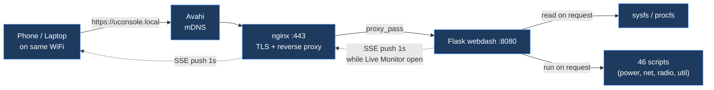

# Architecture

Three-tier system. Device pushes telemetry to a cloud Redis cache; cloud reads on page load; local webdash runs on-demand against sysfs.

## Data flow

Three independent paths. Only one actually *polls*; the other two are event-driven or on-demand.

### 1. Device → Cloud telemetry (systemd timer)

This is the only real polling loop. A user-scope systemd timer fires `push-status.sh` on an interval (default 5 min, configurable via the TUI from `30s` to `30min`, or **off** to opt out entirely).

```mermaid
flowchart LR
  Timer["<b>uconsole-status.timer</b><br/>OnUnitActiveSec (default 5min)"] --> Script["push-status.sh"]
  Script --> Collect["Collect from sysfs/procfs<br/>battery · cpu · mem · disk<br/>wifi · aio board · hardware"]
  Collect --> HTTP["POST /api/device/push<br/>Bearer <device_token>"]
  HTTP --> Redis[("Upstash Redis<br/>persistent, keyed by user+device")]
  Redis -. "read on page load" .-> Dashboard["Next.js Server Component"]

  TUI["<b>TUI</b><br/>CONFIG → Push Interval"] -.->|rewrites OnUnitActiveSec<br/>or disables timer| Timer

  classDef user fill:#1e3a5f,stroke:#58a6ff,color:#fff;
  classDef cloud fill:#2d1a3d,stroke:#d67aff,color:#fff;
  class TUI,Timer,Script,Collect user
  class HTTP,Redis,Dashboard cloud
```



Collected every tick: battery (capacity, voltage, current, health), CPU (temp, load, cores), memory, disk, WiFi (SSID, signal, IP), screen brightness, AIO board presence (SDR, LoRa, GPS, RTC), hardware manifest, webdash status, hostname/kernel/uptime.

**Opting out:** pick **Push Interval → off** in the TUI under `CONFIG`. The timer gets disabled via `systemctl --user disable --now uconsole-status.timer`. Reversible — picking any interval re-enables it.

### 2. Cloud dashboard reads (no polling)

The Next.js dashboard uses React Server Components. Redis is queried **once per page load**, on the server. No client-side setInterval, no WebSocket, no long-poll. Data refreshes when you navigate or reload.

```mermaid
flowchart LR
  Browser["Browser"] -->|GET /<br/>(on load / nav)| Edge["Vercel Edge"]
  Edge --> RSC["React Server Component<br/>app/page.tsx"]
  RSC --> Redis[("Upstash Redis")]
  Redis --> RSC
  RSC -->|streamed HTML| Edge
  Edge -->|streamed HTML| Browser

  classDef cloud fill:#2d1a3d,stroke:#d67aff,color:#fff;
  class Browser,Edge,RSC,Redis cloud
```

The dashboard is always "as fresh as the last push". If your device has pushed in the last 5 minutes you see live state; if it's offline you see the last-known snapshot with a staleness indicator.

### 3. Local webdash (on-demand + SSE)

The Flask webdash at `https://uconsole.local` reads sysfs and runs shell scripts **on request**. The Live Monitor panel uses Server-Sent Events for a 1-second push from Flask → browser while the panel is open; closing the panel ends the stream.



No scheduled background polling from the webdash itself — scripts only run when you click them.

## Project layout

```
frontend/src/
├── app/            Pages, API routes, server actions
├── components/
│   ├── dashboard/  17 sections (DeviceStatus, BackupHistory, HardwarePanel, etc.)
│   └── viz/        7 visualizations (Sparkline, Donut, CalendarGrid, Treemap, etc.)
├── lib/            20 modules (auth, redis, github, types, utils, etc.)
└── __tests__/      10 test suites (parsing, security, validation, API)

device/
├── bin/            Entry points (console, webdash, uconsole-setup, uconsole-passwd)
├── lib/tui/        TUI modules — each a feature area:
│   ├── framework.py    Main loop, menus, runners, registry plumbing
│   ├── esp32_hub.py    ESP32 firmware detect + flash flows (HANDLERS-registered)
│   ├── adsb_menu.py    ADS-B layer picker + hi-res fetch entry helpers
│   ├── processes.py    Process manager
│   ├── launcher.py     Child-process launcher for external programs
│   ├── monitor.py      Live system monitor
│   ├── network.py      WiFi switcher, hotspot, bluetooth
│   ├── tools.py        Git, notes, calculator, SSH bookmarks
│   ├── games.py        Minesweeper, snake, tetris, 2048, ROM launcher
│   ├── radio.py        GPS globe, FM radio
│   ├── marauder.py     ESP32 Marauder + wardrive
│   ├── mimiclaw.py     MimiClaw AI agent chat/serial/status/wifi
│   ├── meshtastic_map.py  Meshtastic mesh map
│   ├── telegram.py     Telegram client (tg + tdlib)
│   ├── watchdogs.py    Watch Dogs Go wardriving game
│   ├── adsb.py, adsb_hires.py, adsb_home_picker.py,
│   │   adsb_layer_picker.py, adsb_basemap_info.py
│   │                   Global ADS-B map + basemap + pickers
│   ├── services.py     Systemd service/timer management
│   ├── config_ui.py    Theme picker, view mode, settings
│   ├── files.py        File browser
│   ├── esp32_detect.py Chip detection (utility, not a TUI handler)
│   └── esp32_flash.py  Firmware flashing (utility, not a TUI handler)
├── scripts/        46 shell scripts organized by category:
│   ├── system/     backup, restore, update, push-status
│   ├── power/      battery, charge, cpu-freq, discharge tests
│   ├── network/    wifi, hotspot, wifi-fallback
│   ├── radio/      sdr, lora, gps, esp32
│   └── util/       webdash-ctl, audit, storage, diskusage
├── webdash/        Flask app (app.py, templates, static)
└── share/          Default configs, systemd units, keybind snippets

packaging/
├── build-deb.sh    Build script — reads from device/, outputs .deb
├── control         Package metadata + dependencies
├── postinst        Post-install (SSL certs, user detection, nginx, systemd)
├── prerm           Pre-remove (stop services)
├── postrm          Post-remove (purge configs)
├── systemd/        7 unit files
├── nginx/          HTTPS reverse proxy config
└── scripts/        APT repo generation + GPG key setup
```

## Key patterns

- Dashboard sections are Server Components that fetch from Redis/GitHub on page load
- `lib/` modules handle all data access — components don't call APIs directly
- Visualization components are client-only (`'use client'`) for interactivity
- TUI feature modules export a module-level `HANDLERS = {"_foo": fn}` dict; framework.py walks `FEATURE_MODULES` and merges them at first use. A module that fails to import has its menu items hidden (logged to `~/crash.log`).
- Shell scripts are organized by category and referenced in menus with subdir prefixes (e.g. `power/battery.sh`)
